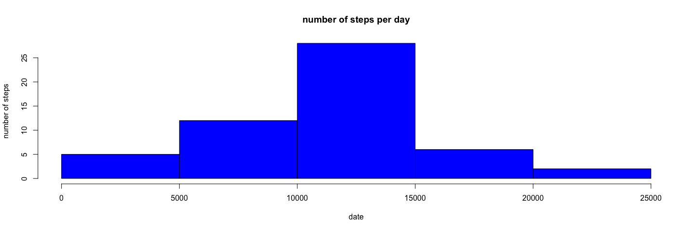
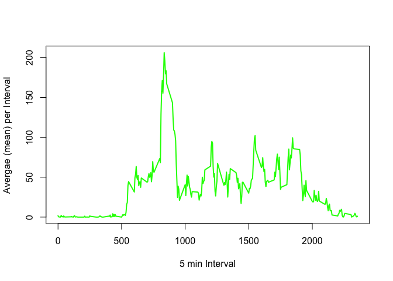
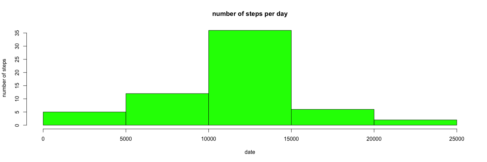
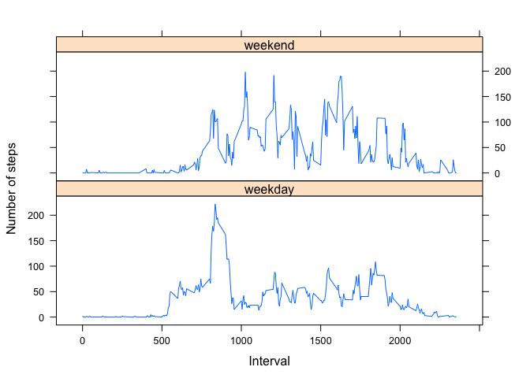

# Reproducible Research: Peer Assessment 1
## Required Libs

```r
library(ggplot2)
library(lattice)
```

## Loading and preprocessing the data

Loading File


```r
#1 loading the data
file <- read.csv("activity.csv")
file$date <- as.Date(file$date, "%Y-%m-%d")
```

## What is mean total number of steps taken per day?


```r
#2-1 Aggregating the data of steps per day
totalSteps <- aggregate(steps ~ date,data=file,FUN=sum,na.rm=TRUE)

#2-2 Histogram
hist(totalSteps$steps,main="number of steps per day",xlab="date",ylab="number of steps",col="blue")
```

 

calc the mean + median


```r
#2-3 calc the mean
mean(totalSteps$steps)
```

```
## [1] 10766.19
```

```r
#2-3 calc the median
median(totalSteps$steps)
```

```
## [1] 10765
```

## What is the average daily activity pattern?
Ploting the avergae time interval over a week

```r
#3-1 Aggregating the data of avg steps per 5 min time interval
mininterval <- aggregate(file$steps,list(file$interval),FUN=mean,na.rm=TRUE)

#3-1 plot type="l" of avergae per 5 min time interval over a week
plot(mininterval$Group.1, mininterval$x, type="l", xlab="5 min Interval", ylab= "Avergae (mean) per Interval", col="green" , lwd=2)
```

 

Max Interval


```r
#3-2 finding max interval
maxIntervalLine <- which.max(mininterval$x)

maxInterval <- mininterval$Group.1[maxIntervalLine]

maxInterval
```

```
## [1] 835
```

## Imputing missing values

Number of rows with "N" value 

```r
#4-1 number of rows with NA value 
length(file$steps[is.na(file$steps)])
```

```
## [1] 2304
```
Replacing the NA with average of same time interval

```r
#4-3 replacing NA value with average on the same 5 min time interval
imp <- numeric(length(file$steps))
for(i in  1:length(file$steps))
{
        if(is.na(file$steps[i]))
        {
                imp[i] = mininterval$x[mininterval$Group.1==file$interval[i]]
        }
        else
        {
                imp[i] = file$steps[i]
        }
}

#add new imp column to file
file$imp <- imp
```

Histogram of total steps per day

```r
#4-4 Aggregating the data of total steps per day
impSteps <- aggregate(imp ~ date,data=file,FUN=sum,na.rm=TRUE)

#4-4 Histogram
hist(impSteps$imp,main="number of steps per day",xlab="date",ylab="number of steps",col="green")
```

 

Calc of mean and median

```r
#4-4 calc the mean
mean(impSteps$imp)
```

```
## [1] 10766.19
```

```r
#4-4 calc the median
median(impSteps$imp)
```

```
## [1] 10766.19
```
Observations:

* Do these values (mean and median) differ from the estimates from the first part of the assignment? Not a real change.

* What is the impact of imputing missing data on the estimates of the total daily number of steps? The histogram remains similar to the histogram from before. The frequency counts increased as expected. It seems that the data imputation strategy should work as expected.

## Are there differences in activity patterns between weekdays and weekends?


```r
#5-1 setting new data colomn with weekend and weekday values (weekend == Saterday + Sunday)
days <- weekdays(as.Date(file$date))
dayType = vector()
for(d in 1:length(file$steps))
{
        if(days[d] == 'Saterday')
        {
                dayType[d] = 'weekend'
        }
        else if(days[d] == 'Sunday')
        {
                dayType[d] = 'weekend'
        }
        else
        {
                dayType[d] = 'weekday'
        }
}

file$dayType <- dayType

meanIntervalDayType <- aggregate(steps ~ interval + dayType,file,mean)
names(meanIntervalDayType) <- c("interval", "daytype", "steps")

xyplot(steps ~ interval | daytype, meanIntervalDayType, type = "l", layout = c(1, 2),  xlab = "Interval", ylab = "Number of steps")
```

 
